# A GARY BUSEY LOOK A LIKE SERIVE
## Two-sided market place app

### Identification of the problem you are trying to solve by building this particular marketplace app

Most celebrity impersonation services simply do not have an adequate number of Gary Busey lookalikes and are generally of so so quality. If one needs to find a Gary Busey lookalike one has to wade through other celebrities which is time consuming and hard on the eyes.

### Why is it a problem that needs solving?

It is far from uncommon for a host, when planning special occasions to want or even require someone who resembles Gary Busey and mingle at the event while also inserting random dialogue from Gary Busey movies into conversation.

Conversley people who resemble Gary Busey have few options shoudl they wish to capitalise from their gifts. The bureaucracy of most lookalike services are highly ineffecient expending most of their time and resources on too wide a range of celebrities.

This application will solve these problems by streamlining and facilitating the correspondence and transaction of these parties.


## Link to deployed site: 

## Link to GitHub repository: 
https://github.com/Nickphammond/garry_busey_lookalike_app


## Description of your marketplace app (website)

### Purpose
The purpose of this app is to facilitate the hiring of Gary Busey lookalikes for events. Currently there is no other app that does this.

### Functionality / Features

User account: A user can without creating an account or logging into an existing account, look through the lookalikes and publicly listed events. However to actually be able to click on a lookalike or event and get more details one must create an account.
Upon creating and logging into an account the user is able to create events. When a lookalike gives an expression of interest the user can accept.
If the user wishes to become a lookalike themselves they can activate their lookalike status from their profile page.

Events: An event is created with an date, time and location. There is a further option as to whether one wants to make this event listing publicly listed or not. If it is it will appear in the events page. One can click on each event to get more details about it.

Lookalikes: Once a user has activated their lookalike account they are able to upload photos for their lookalike profile. Lookalikes are able to send expressions of interest to an event from which the host can accept.

Payment: When a user has accepted a lookalikes request they are able to pay them the fee.


### Sitemap

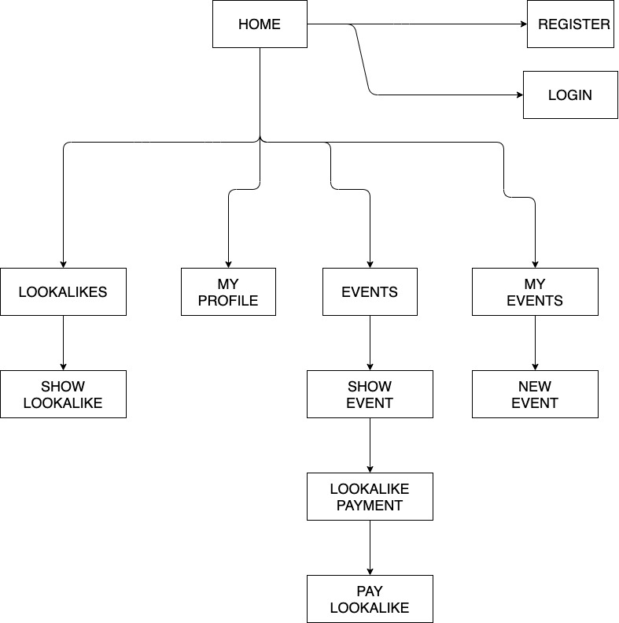

### Screenshots

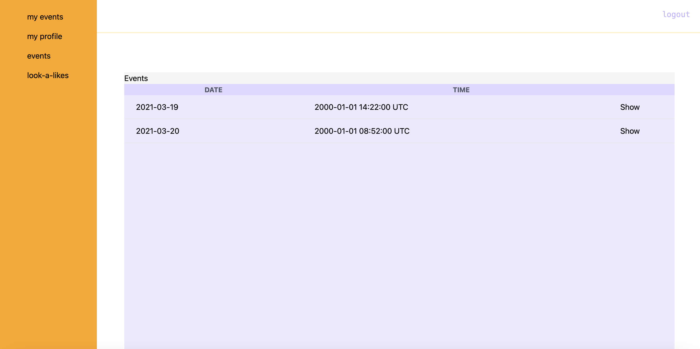

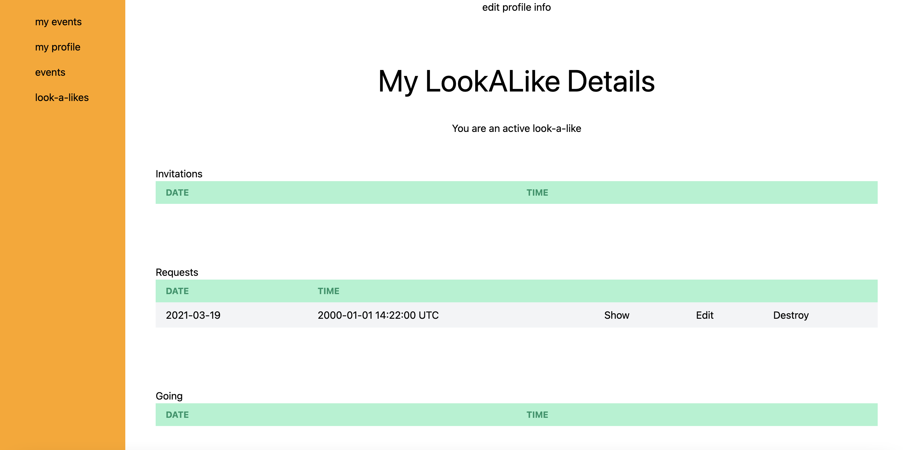
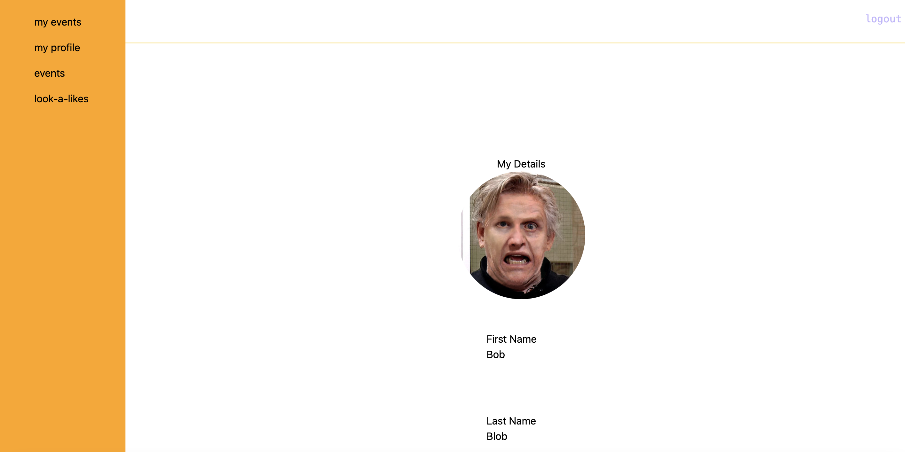
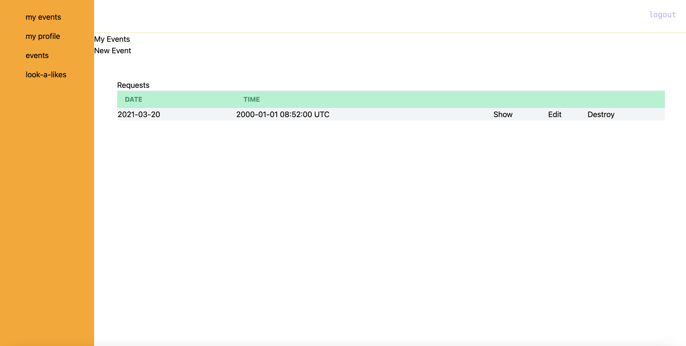


### Target audience

The target audience is for any person who wishes to be seen as a competent host, be it birthday party, work christmas party, corporate event, weddings etc.


### Tech stack (e.g. html, css, deployment platform, etc)

Front-end: HTML, CSS, Tailwind, Embedded Ruby

Back-end: Ruby, Ruby on Rails, Devise

Database: Postgresql

Deployment: Heroku

Payment: Stripe


### User stories for your app


As a user I wish to have a secure account which requires a login.

As a user I wish to be able to utilise the application as a host wishing to create an event an hire a lookalike.

As a user I wish to be able to utilise the application as lookalike looking for events to attend.


As a host I wish to be able to be able to register an event so lookalikes may respond.

As a host I wish to have lookalikes register their interest for an event.

As a host I wish to be able to accept and confirm the interest of a lookalike.

As a host I wish to be able to finalise the payment to a lookalike for an event.


As a lookalike I wish to be able to find a list of events requiring a lookalike.

As a lookalike I wish to be able to submit my interest for an event.

As a lookalike I wish to be able to have the payment finalised with relatively little involvement from my side.


### Wireframes for your app


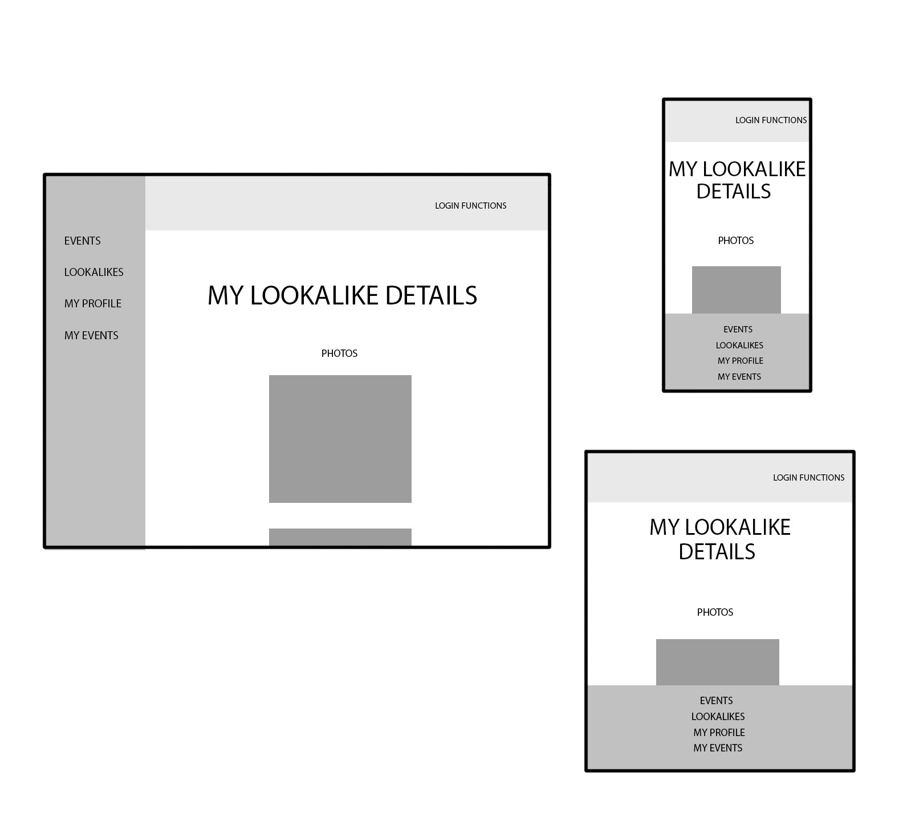
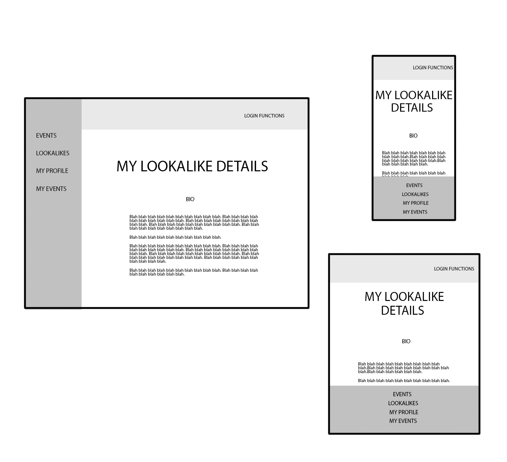
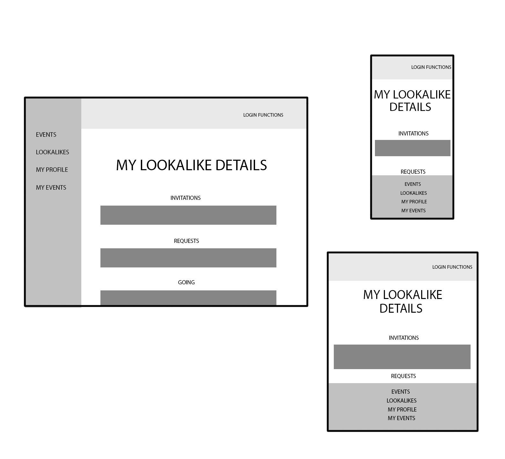
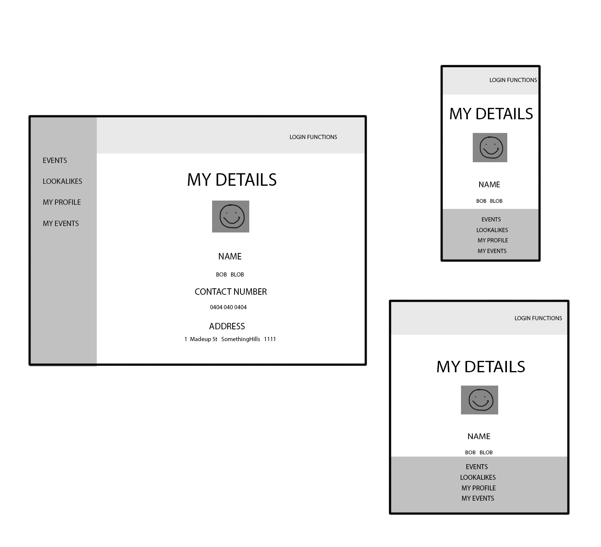
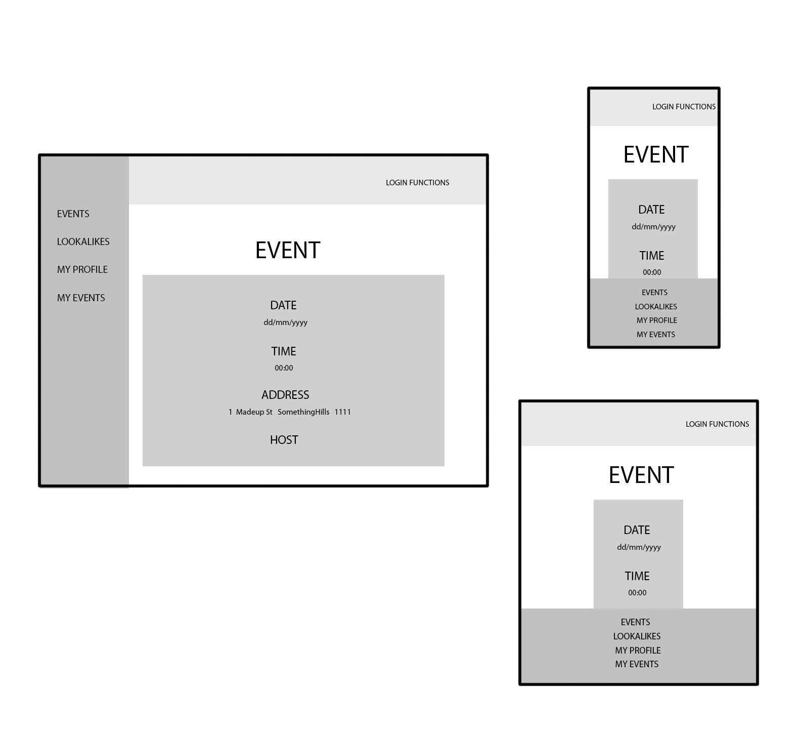
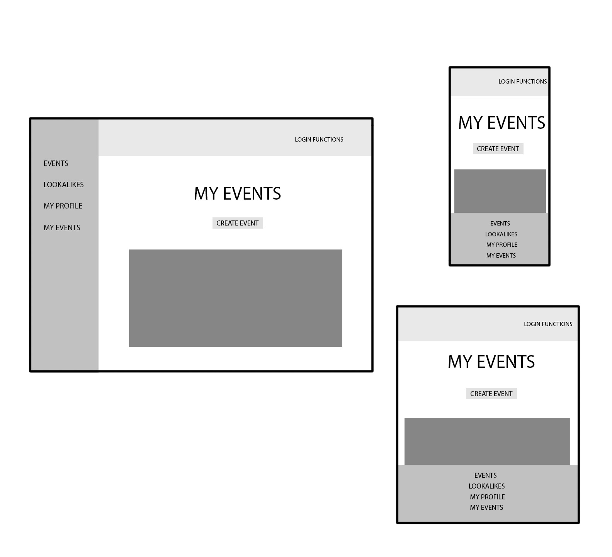
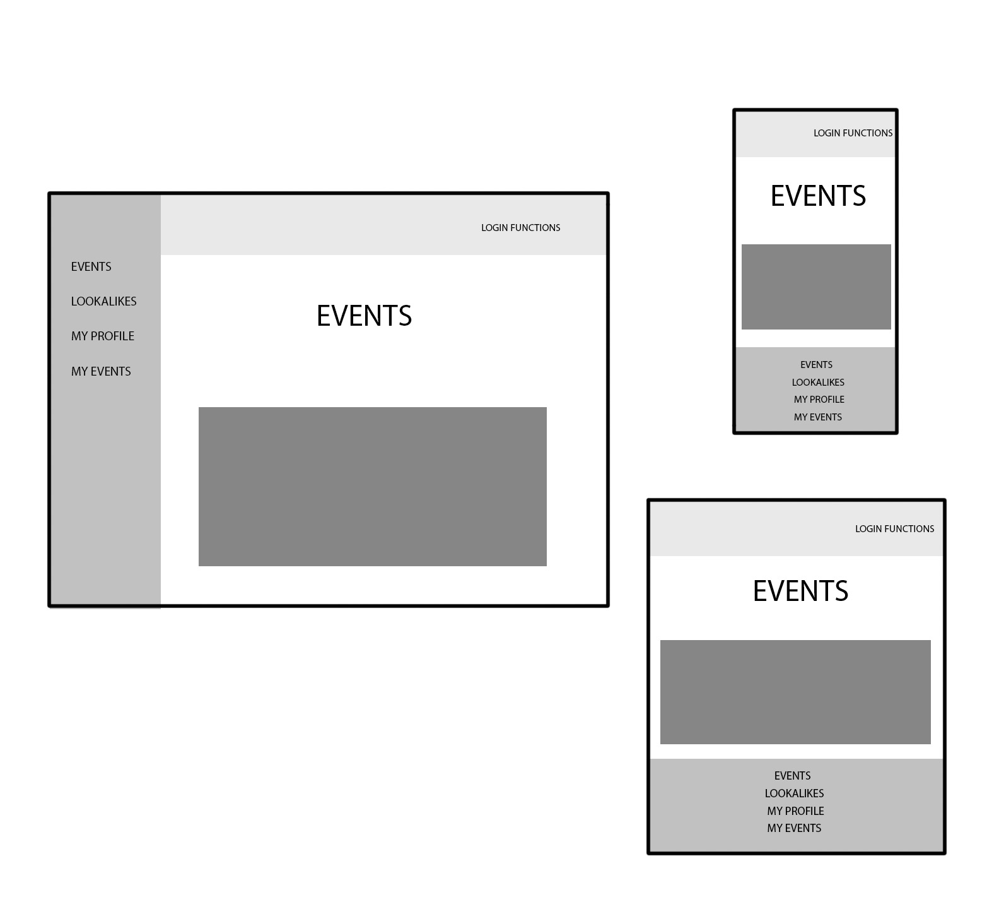


### An ERD for your app

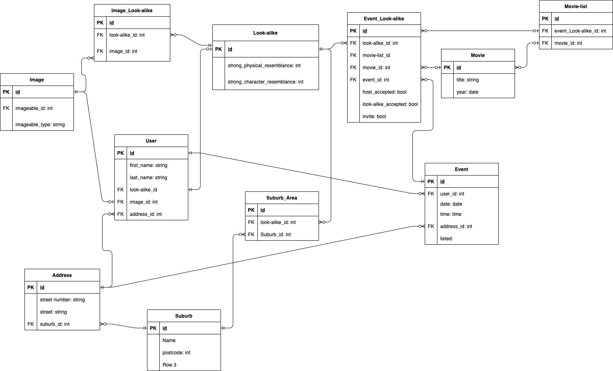


### Explain the different high-level components (abstractions)

The Gary Busey Lookalike services application is a two way market place where the two parties involved in the transaction are the host and the lookalike. The application conforms to the Model View Controller (MVC) paradigm. This involves a delineation of the roles a web based application following the Hypertext Transer Protocol (HTTP) must perform. 
Broadly speaking: 

The classes of objects that the application requires for it's functioning belong within the model. Any logic pertaining to the manipulation of these classes, or models is to be defined here.

The content of the files sent to the user's browser falls under the concern of the view. The extent to which the view has any effect on the contents of the model is limited to only the presence of forms where a user may submit data. While there should be no logic in the view pertaining to the manipulation of the models, or even to what information will be sent to the user, there can be logic in the view responsible for displaying the information sent.

The final component of the MVC paradigm is the controller which is the part of the code which is responsible for what files should be sent and what instructions should be sent to the model depending on the user's requests.

The generation of these componenents is achieved through the Ruby on Rails framework which explicitly follows the MVC paradigm.


The actual instances of the models are held by a database. This application uses PostgreSQL as it's database management system.

There is a model for the user, appropriately named 'User' which is responsible for holding the user's information and relations to other models. When logging there is a gem installed in the application named Devise which is responsible for authentication. That is it provided a security measure where a user is unable to access another user's data. In more colloquial terms, the application requires the user to login.

There is also a model for events which contains the information and allows for the creation of an event by the user. A lookalike can give an expression of interest. 

There is also a model for the lookalike, of which an instance of can be created by the user, which allows them to participate as a lookalike themselve on the app.

For the payment of the lookalike by the user there is an API called Stripe.


### Detail any third party services that your app will use

Ruby on Rails - This is a framework to be used with Ruby for the streamlined development of web based applications following the MVC paradigm. It is free and can be installed using gem installation.

Desvise - A ruby gem but which is to be used specifically with rails for performing authentication of users. Creating an application which is secure for users is a difficult and involved process whereby oversights or mistakes can leave one vunerable. Devise handles all this for one's Rails application in a reliable way with just a few commands.

Stripe - This is a service which provides an API for performing financial transactions. Due to the complexity of performing financial transactions, the Rails application once the appropriate gem is installed, sends commands to Stripe which takes care of the actual transaction.

Tailwind - This is a CSS framework, similar in concept to Bootstrap that allows for the fast styling of HTML through predefined CSS classes. It differs from Bootstrap in that the classes are designed for finer control.


### Describe your projects models in terms of the relationships (active record associations) they have with each other

A user belongs to an address
A user belongs to a look_a_like
A user belongs to an image
A user has many events
A user has one attached image


a look_a_like has many attached images
a look_a_like has many events
a look_a_like has many suburbs


an event belongs to a user
an event belongs to an address
an event has many look_a_likes


an image has one user
an image has one look_a_like

an address has many users
an address has many suburbs

a suburb has many addresse
a suburb has many look_a_likes


class Suburb < ApplicationRecord
    has_many :addresses
    has_many :suburbs_areas
    has_many :look_a_likes, through: :suburbs_areas
end

look_a_like
    # has_many :images
    has_many_attached :images

    has_many :events_look_a_likes
    has_many :events, through: :events_look_a_likes

    has_many :suburbs_areas
    has_many :suburbs, through: :suburbs_areas

    accepts_nested_attributes_for :user, :events


Event

    belongs_to :address
    belongs_to :user

    has_many :events_look_a_likes, dependent: :destroy 
    has_many :look_a_likes, through: :events_look_a_likes

    accepts_nested_attributes_for :address
    accepts_nested_attributes_for :user

image

  belongs_to :imageable, polymorphic: true

  has_one :user

  has_one :look_a_like


Address


  has_many :users
  has_many :events
  belongs_to :suburb, optional: true

  accepts_nested_attributes_for :users, :events
  accepts_nested_attributes_for :suburb


### Discuss the database relations to be implemented in your application


User relates to:
    Image with a foreign key
    Address with a foreign key
    LookALike with a foreign key

    Event without a foreign key


LookALike relates to:
    User without a foreign key
    Event without a foreign key, through EventLookALike
    Image without a foreign key, through ImageLookALike
    Suburb without a foreign key, through SuburbArea


Event relates to:
    User with a foreign key
    Address with a foreign key

    LookALike without a foreign key, through EventLookALike


Image relates to:
    User without a foreign key
    LookALike without a foreign key, through ImageLookALike


Address relates to:
    Suburb with a foreign key

    User without a foreign key
    Event without a foreign key


Suburb relates to:
    Address without a foreign key
    EventLookALike without a foreign key through SuburbArea


### Provide your database schema design

```
create_table "active_storage_attachments", force: :cascade do |t|
    t.string "name", null: false
    t.string "record_type", null: false
    t.bigint "record_id", null: false
    t.bigint "blob_id", null: false
    t.datetime "created_at", null: false
    t.index ["blob_id"], name: "index_active_storage_attachments_on_blob_id"
    t.index ["record_type", "record_id", "name", "blob_id"], name: "index_active_storage_attachments_uniqueness", unique: true
  end

  create_table "active_storage_blobs", force: :cascade do |t|
    t.string "key", null: false
    t.string "filename", null: false
    t.string "content_type"
    t.text "metadata"
    t.bigint "byte_size", null: false
    t.string "checksum", null: false
    t.datetime "created_at", null: false
    t.index ["key"], name: "index_active_storage_blobs_on_key", unique: true
  end

  create_table "addresses", force: :cascade do |t|
    t.string "street_number"
    t.string "street_name"
    t.bigint "suburb_id", null: false
    t.datetime "created_at", precision: 6, null: false
    t.datetime "updated_at", precision: 6, null: false
    t.index ["suburb_id"], name: "index_addresses_on_suburb_id"
  end

  create_table "events", force: :cascade do |t|
    t.date "date"
    t.time "time"
    t.datetime "created_at", precision: 6, null: false
    t.datetime "updated_at", precision: 6, null: false
    t.bigint "address_id"
    t.bigint "user_id"
    t.boolean "listed"
    t.index ["address_id"], name: "index_events_on_address_id"
    t.index ["user_id"], name: "index_events_on_user_id"
  end

  create_table "events_look_a_likes", force: :cascade do |t|
    t.bigint "event_id", null: false
    t.bigint "look_a_like_id", null: false
    t.bigint "movie_id"
    t.boolean "look_a_like_accepted"
    t.boolean "host_accepted"
    t.boolean "invite"
    t.datetime "created_at", precision: 6, null: false
    t.datetime "updated_at", precision: 6, null: false
    t.integer "price", default: 50
    t.index ["event_id"], name: "index_events_look_a_likes_on_event_id"
    t.index ["look_a_like_id"], name: "index_events_look_a_likes_on_look_a_like_id"
    t.index ["movie_id"], name: "index_events_look_a_likes_on_movie_id"
  end

  create_table "images", force: :cascade do |t|
    t.string "imageable_type", null: false
    t.bigint "imageable_id", null: false
    t.datetime "created_at", precision: 6, null: false
    t.datetime "updated_at", precision: 6, null: false
    t.index ["imageable_type", "imageable_id"], name: "index_images_on_imageable_type_and_imageable_id"
  end

  create_table "look_a_likes", force: :cascade do |t|
    t.datetime "created_at", precision: 6, null: false
    t.datetime "updated_at", precision: 6, null: false
    t.text "bio"
    t.bigint "image_id"
    t.index ["image_id"], name: "index_look_a_likes_on_image_id"
  end

  create_table "movies", force: :cascade do |t|
    t.string "title"
    t.date "year"
    t.datetime "created_at", precision: 6, null: false
    t.datetime "updated_at", precision: 6, null: false
  end

  create_table "suburbs", force: :cascade do |t|
    t.string "name"
    t.integer "postcode"
    t.datetime "created_at", precision: 6, null: false
    t.datetime "updated_at", precision: 6, null: false
  end

  create_table "suburbs_areas", force: :cascade do |t|
    t.bigint "look_a_like_id", null: false
    t.bigint "suburb_id", null: false
    t.datetime "created_at", precision: 6, null: false
    t.datetime "updated_at", precision: 6, null: false
    t.index ["look_a_like_id"], name: "index_suburbs_areas_on_look_a_like_id"
    t.index ["suburb_id"], name: "index_suburbs_areas_on_suburb_id"
  end

  create_table "users", force: :cascade do |t|
    t.string "email", default: "", null: false
    t.string "encrypted_password", default: "", null: false
    t.string "reset_password_token"
    t.datetime "reset_password_sent_at"
    t.datetime "remember_created_at"
    t.datetime "created_at", precision: 6, null: false
    t.datetime "updated_at", precision: 6, null: false
    t.string "first_name"
    t.string "last_name"
    t.bigint "address_id"
    t.bigint "look_a_like_id"
    t.bigint "image_id"
    t.index ["address_id"], name: "index_users_on_address_id"
    t.index ["email"], name: "index_users_on_email", unique: true
    t.index ["image_id"], name: "index_users_on_image_id"
    t.index ["look_a_like_id"], name: "index_users_on_look_a_like_id"
    t.index ["reset_password_token"], name: "index_users_on_reset_password_token", unique: true
  end

  add_foreign_key "active_storage_attachments", "active_storage_blobs", column: "blob_id"
  add_foreign_key "addresses", "suburbs"
  add_foreign_key "events", "addresses"
  add_foreign_key "events", "users"
  add_foreign_key "events_look_a_likes", "events"
  add_foreign_key "events_look_a_likes", "look_a_likes"
  add_foreign_key "events_look_a_likes", "movies"
  add_foreign_key "look_a_likes", "images"
  add_foreign_key "suburbs_areas", "look_a_likes"
  add_foreign_key "suburbs_areas", "suburbs"
  add_foreign_key "users", "addresses"
  add_foreign_key "users", "images"
  add_foreign_key "users", "look_a_likes"

  ```


### Describe the way tasks are allocated and tracked in your project


For project management I used Trello
See: https://trello.com/b/W4A3L37c/gary-busey-app
